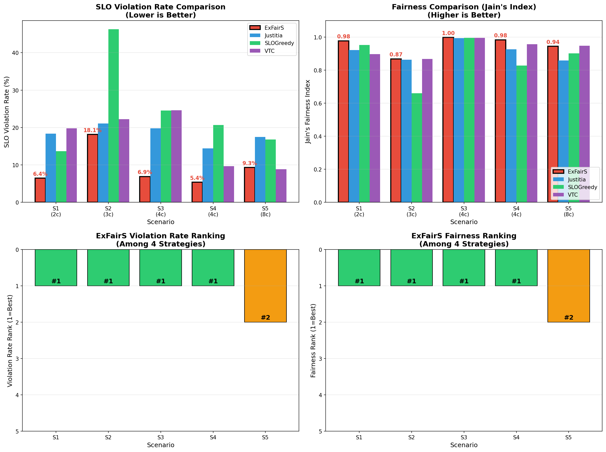
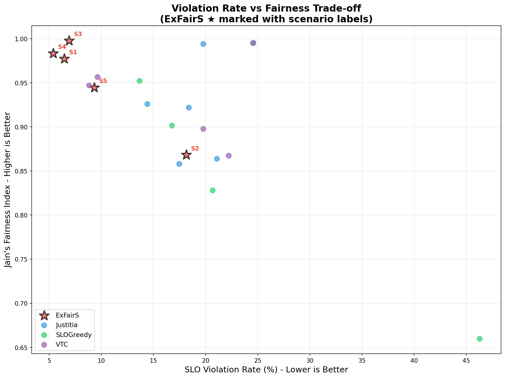
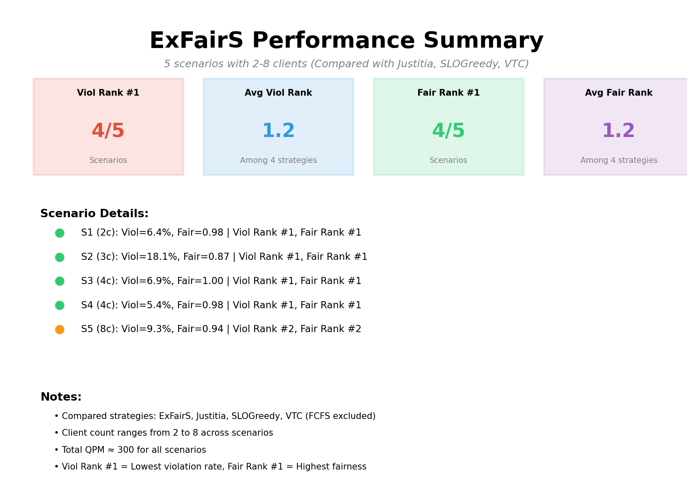

# ExFairS 性能展示

本文件夹包含 5 个场景的实验结果，展示 ExFairS 与其他调度策略的对比。

## 对比策略

- **ExFairS** - 体验式公平调度（我们的方法）
- **Justitia** - 虚拟时间调度
- **SLOGreedy** - SLO违约率贪心调度
- **VTC** - 可变Token积分

> 注：FCFS（先到先服务）已从对比中排除

---

## 场景配置汇总表

| 序号 | 场景 | 客户端数 | 总QPM | SLO范围 | ExFairS违约率排名 | ExFairS公平性排名 |
|:----:|:-----|:--------:|:-----:|:-------:|:-----------------:|:-----------------:|
| S1 | 双客户端对比 | 2 | 300 | 7-12s | **#1** | **#1** |
| S2 | 三客户端梯度 | 3 | 300 | 6-12s | **#1** | **#1** |
| S3 | 均衡负载 | 4 | 300 | 8s | **#1** | **#1** |
| S4 | 实时vs批处理 | 4 | 290 | 6-14s | **#1** | **#1** |
| S5 | 混合压力 | 8 | 300 | 5-15s | #2 | #2 |

---

## 可视化图表

### 1. 策略对比图 (`exfairs_comparison.png`)



包含4个子图：
- **左上**: 各场景违约率柱状图
- **右上**: 各场景公平性柱状图
- **左下**: ExFairS 违约率排名
- **右下**: ExFairS 公平性排名

### 2. 违约率 vs 公平性散点图 (`exfairs_tradeoff_scatter.png`)



展示各策略在"违约率-公平性"权衡空间中的位置。

### 3. 综合信息图 (`exfairs_summary.png`)



关键指标汇总和场景详情。

---

## 场景详细信息

### S1: 双客户端对比（2客户端）

**来源**: run_20260129_020704/scenario_I

| 客户端 | QPM | SLO | 说明 |
|:------:|:---:|:---:|:-----|
| 1 | 150 | 7s | 严格SLO |
| 2 | 150 | 12s | 宽松SLO |

---

### S2: 三客户端梯度（3客户端）

**来源**: run_20260129_020704/scenario_II

| 客户端 | QPM | SLO | 说明 |
|:------:|:---:|:---:|:-----|
| 1 | 80 | 6s | 高优先级 |
| 2 | 100 | 9s | 中优先级 |
| 3 | 120 | 12s | 低优先级 |

---

### S3: 均衡负载（4客户端）

**来源**: run_20260128_115151/scenario_I

| 客户端 | QPM | SLO | 说明 |
|:------:|:---:|:---:|:-----|
| 1-4 | 75 | 8s | 完全均衡 |

---

### S4: 实时型 vs 批处理型（4客户端）

**来源**: run_20260128_115151/scenario_III

| 客户端 | QPM | SLO | 说明 |
|:------:|:---:|:---:|:-----|
| 1-2 | 55 | 6s | 实时型（严格SLO） |
| 3-4 | 90 | 14s | 批处理型（宽松SLO） |

---

### S5: 混合压力场景（8客户端）

**来源**: run_20260129_020704/scenario_VII

| 客户端组 | 数量 | QPM | SLO | 说明 |
|:--------:|:----:|:---:|:---:|:-----|
| 大客户 | 2 | 80 | 10-12s | 高流量 |
| 紧急小客户 | 2 | 30 | 5s | 最严格SLO |
| 普通小客户 | 2 | 25 | 8s | 中等SLO |
| 低优先级 | 2 | 15 | 15s | 最宽松SLO |

---

## 文件结构

```
exfairs_best_scenarios/
├── README.md                      # 本文件
├── scenarios_data.json            # 场景数据（JSON格式）
├── exfairs_comparison.png         # 策略对比图
├── exfairs_tradeoff_scatter.png   # 违约率vs公平性散点图
├── exfairs_summary.png            # 综合信息图
├── 01_2clients_scenario_I/        # S1: 2客户端
├── 02_3clients_scenario_II/       # S2: 3客户端
├── 03_4clients_scenario_I/        # S3: 4客户端（均衡）
├── 04_4clients_scenario_III/      # S4: 4客户端（实时vs批处理）
└── 05_8clients_scenario_VII/      # S5: 8客户端（混合压力）
```

---

**生成时间**: 2026-01-29  
**对比策略**: ExFairS, Justitia, SLOGreedy, VTC
